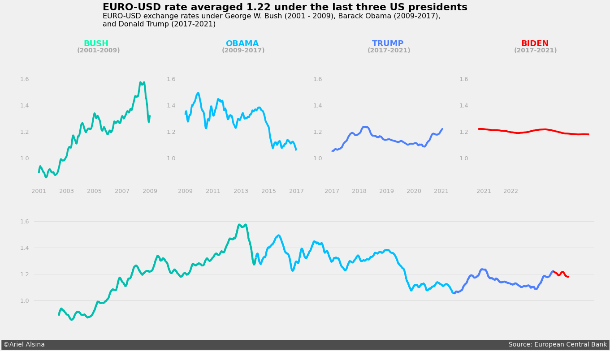
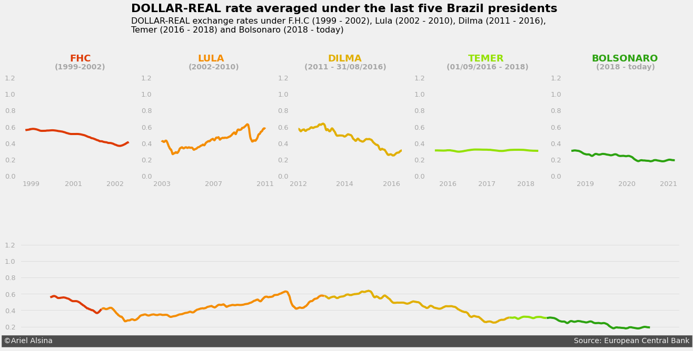
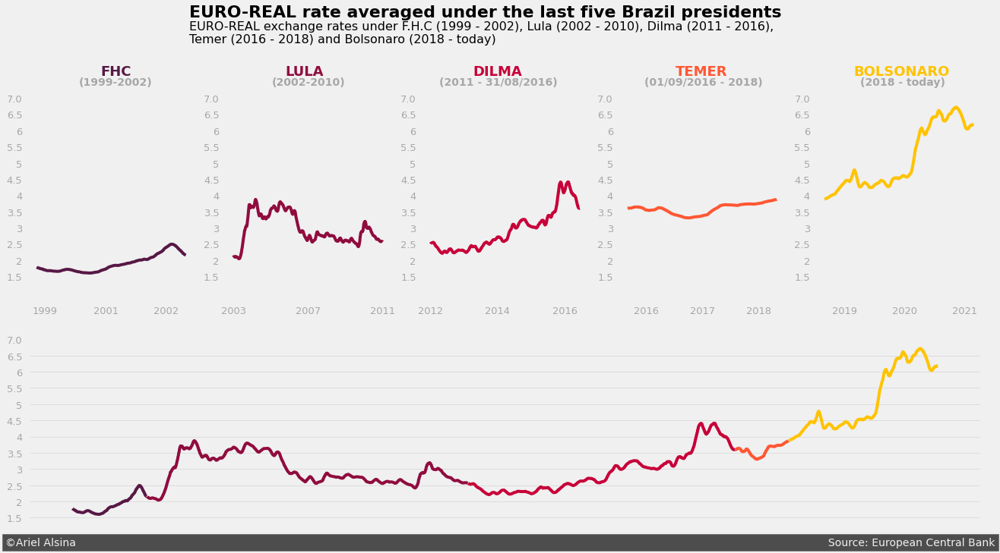

# A brief walkthrough on data story telling
This project aims for a brief and clear revision about the most used concepts of data visualization, in specific, data story telling. For this, the [Daily Exchange Rates per Euro 1999-2021](https://www.kaggle.com/lsind18/euro-exchange-daily-rates-19992020) found in *Kaggle* is being used. This dataset contains the parity of a certain group of curriencies in comparison to the Euro, dating from since the start of the XXI century to nowadays.

As an extension of the objective of this project, the usage libraries such as ```pylint```, ```autopep8``` and ```logging``` were used as forms of making the project as near as possbible of what it would be if this was in an 'in development system'. 

# Installing the dependencies
If you have anaconda installed, you can create an isolated enviroment using:

    $ conda create --name storytelling python==3.10
    $ conda activate storytelling


For the installation of the necessary libraries to make this project run, it is achievable by executing the following command (on this repo root folder):

    $ pip install -r requirements.txt

# Testing 
For the testing of the python script ```.py```, use:

    $ pytest .

# PEP8
To verify if the script is in conform to the PEP8 best practices of programming, use:

    $ pylint script.py


# What is all this code doing?
Basically, what is being propose here is a simple and meaningful visualization of the data for the United States and Brazil scenarios, where is shown how strong the country's coin was along the period of 1999 - 2021 (and emphatizing which were presidents at that moment).

## Euro to Dollar 

## Euro to Brazilian Real

## Dollar to Brazilian Real
